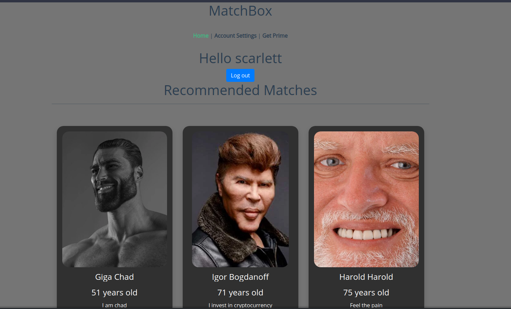

= Εφαρμογή Γνωριμιών
:toc:
:toc-title:
:source-highlighter: rouge
:source-language: js

.ΔΕΥΤΕΡΗ ΕΡΓΑΣΙΑ ΣΤΟ ΜΑΘΗΜΑ ΗΛΕΚΤΡΟΝΙΚΟ ΕΜΠΟΡΙΟ
[NOTE]
****
[.text-center]
Αυτό το έγγραφο είναι το φύλλο αναφόρας της εργασίας στα μαθήματα "Ηλεκτρονικό Εμπόριο και Επιχειρηματικότητα" και "Τεχνολογιά και Προγραμματισμός Κινητών Συσκευών"
****

Ιάκωβος Μαστρογιαννόπουλος - 711242017102 +
Τυμοτέους Λέοναρντ Στεφάνιακ - 711171012

== Εισαγωγή

Αυτή είναι η κοινή εργασία που εκπονήθηκε για τα μάθημα "Ηλεκτρονικό Εμπόριο και Επιχειρηματικότητα" και "Τεχνολογιά και Προγραμματισμός Κινητών Συσκευών" που είχε θέμα μία ιστοσελίδα και Android εφαρμογή γνωριμίας. Οι τεχνολογίες που επιλέχθηκαν για την υλοποίηση του πρότζεκτ είναι οι εξής:

    * Για την ιστοσελίδα, χρησιμοποίηθηκε η https://vuejs.org/[**VueJS**], όπου είναι ένα framework της https://nodejs.org/en/[**NodeJS**], ένω η γλώσσα που γράφτηκαν τα scripts ήταν η https://www.typescriptlang.org/[**TypeScript**].
    * Για την Android εφαρμόγη, χρησιμοποίηθηκε το https://developer.android.com/studio[**AndroidStudio**], με την γλώσσα προεπιλογής την https://www.java.com/en/[**Java**].
    * Για το REST API, χρησιμοποίηθηκε η https://www.python.org/[**Python**], με συγκεκρίμενο framework το https://flask.palletsprojects.com/en/2.0.x/[**Flask**].
    * Για την αποθήκευση των δεδομένων σε μια βάση, επιλέχθηκε η https://www.mongodb.com/[**MongoDB**], η οποία είναι μια μόντερνα, noSQL βάση δεδομένων, σχεδιασμένη για την επερχόμενη Cloud εποχή.
    * Για την ευκολία της εγκατάστασης της εφαρμογής, χρησιμοποίηθηκε ως έξτρα το https://docs.docker.com/engine/swarm/[**Docker Swarm**], δουλεύοντας σε Single Node.

=== Γενικές πληροφορίες για την αρχική σελίδα

Η VueJS χωρίζει κάθε σελίδα της σε ένα διαφορετικό https://vuejs.org/v2/guide/components.html[**component**], το οποίο με λίγα λόγια θυμίζει το layout του AndroidStudio και μπορεί να ενσωματωθεί σε αλλά components ως template. Αλλό ένα κοινό χαρακτηριστικό της VueJS με το Android είναι ότι έχει https://vuejs.org/v2/guide/instance.html[**Circle of Life**]. +
Για την εφαρμόγη, δημιουργήθηκαν εφτά κύρια components και τρία δευτερεύουσα που ο σκοπός τους είναι να δουλεύουν ως templates με κοινό κώδικα. Για την αντιστοίχηση component και url, χρησιμοποιήθηκε το https://router.vuejs.org/[**Vue Router**] το οποίο βρίσκεται στο αρχείο *index.ts*. Συγκεκριμένα, ο κώδικας είναι ο εξής:

[source]
--
const routes: Array<RouteConfig> = [
  {
    path: '/',
    name: 'Users',
    component: Users
  },
  {
    path: '/settings',
    name: 'Account',
    component: Account
  },
  {
    path: '/login',
    name: 'Login',
    component: Login
  },
  {
    path: '/prime',
    name: 'Prime',
    component: Prime
  },
  {
    path: '/profile/:id',
    name: 'Profile',
    component: Profile
  },
  {
    path: '/contact/:id',
    name: 'Contact',
    component: Contact
  },
  {
    path: '/paypal',
    name: 'Paypal',
    component: Paypal
  }
]
--

Με αλλά λόγια, άμα ο χρηστής πληκτρολογήσει στον browser του το URL *http://localhost:8080/* θα τον πάει στην αρχική οθόνη που του εμφανίζει όλους τους χρήστες. +
Σε αυτή την σελίδα, ένας συνδεδεμένος χρήστης μπορεί να δει τους άλλους χρήστες. Ένας δωρεάν χρήστης βλέπει τα εξής:

Να παρατηρηθεί ότι ένας απλός χρηστής δεν μπορεί να δει τα filters και του επιστρέφεται μία λίστα από περιορισμένα άτομα (τρία στο σύνολο). Ενάς χρήστης που έχει την prime έκδοση, δηλαδή έχει subscription στην εφαρμόγη, θα του εμφανίζει επιτυχώς όλες τις πληροφορίες.

== Ανάλυση κώδικα

=== Εμφάνιση χωρίς filters

==== VueJS

Αρχικά, όταν φορτώνει η σελίδα, εμφανίζει όλους τους χρήστες. Αυτό γίνεται με σύνδεση σε REST API μέσω της βιβλιοθήκης https://github.com/axios/axios[**axios**] της NodeJS. +
Στην δημιουργία της ιστοσελίδας, χρησιμοποιείται η εξής μέθοδος:

[source]
--
      axios.get(this.path).then((res) => {
            if (this.$session.get('user').type === 'free') {
              for (let i = 0; i < 3; i++) {
                this.users.push({
                  id: res.data.users[i]._id,
                  pfp: res.data.users[i].pfp,
                  username: res.data.users[i].username,
                  email: res.data.users[i].email,
                  name: res.data.users[i].name,
                  surname: res.data.users[i].surname,
                  birthday: res.data.users[i].birthday,
                  bio: res.data.users[i].bio,
                  gender: res.data.users[i].gender,
                  weight: res.data.users[i].weight,
                  height: res.data.users[i].height,
                  eye_colour: res.data.users[i].eye_colour,
                  hair_colour: res.data.users[i].hair_colour
                })
              }
            } else {
              res.data.users.forEach(user => {
                this.users.push({
                  id: user._id,
                  pfp: user.pfp,
                  username: user.username,
                  email: user.email,
                  name: user.name,
                  surname: user.surname,
                  birthday: user.birthday,
                  bio: user.bio,
                  gender: user.gender,
                  weight: user.weight,
                  height: user.height,
                  eye_colour: user.eye_colour,
                  hair_colour: user.hair_colour
                })
              })
            }
          }
      )
    }
--

Όπου ελέγχει άμα ο χρηστής έχει την δωρεάν έκδοση, και εάν ναι, του δείχνει μόνο τρεις.

==== Python

Το REST API, δέχεται το GET request του axios και του επεξεργάζεται τα δεδομένα.

[source,python]
--
@app.route("/", methods=['GET'])
@cross_origin()
--

Στο παρακάτω configuration, ρυθμίζεται ότι όποτε χτυπήθει στο **localhost:5000/** GET request, θα κάνει τους εξής υπολογίσμους.

[source,python]
--
def all_users():
    response_object = {}
    response_object['users'] = get_users(mongo.db.users.find())
    return jsonify(response_object)
--

Ουσιαστικά, βρίσκει όλους τους χρήστες που είναι αποθηκευμένοι στην mongoDB, παιρνεί τα δεδομενά τους και τα στέλνει ως πληροφορίες σε μορφή JSON πίσω στο axios. +
Η get_users() το μόνο που κάνει είναι να γεμίζει μία λίστα με τους χρηστές και να την γυρίζει πίσω.

=== Φιλτραρισμένη αναζήτηση

Στην φιλτραρισμένη αναζήτηση, ο premium χρήστης μπορεί να χρησιμοποιήσει τα φίλτρα για να δει αλλούς χρήστες με τα επιθυμητά του χαρακτηριστικά. Για να φορτωθούν τα δεδομένα στον κώδικα, χρησιμοποίηθηκε η jQuery. +
Ουσιαστικά, δημιουργείτε μία μεταβλητή query για να φτιαχτεί αυτόματα το filter. Ένα δείγμα του κώδικα:

[source]
--
if (min_weight != null || max_weight != null) {
    query = query.concat('"weight": {')
    add_comma = true // Για τα επόμενα, να βάλει κόμμα
    query = (min_weight != null) ? query.concat(`"$gte": ${min_weight}`) : query
    query = (max_weight != null) ? query.concat(`${(min_weight != null) ? ',' : ''}"$lte": ${max_weight}`) : query
    query = query.concat('}')
}
--

Τέλος, κάνει ένα POST request μέσω του axios.

[source]
--
    axios.post(this.path, payload).then((res) => {
        this.users = []
        res.data.users.forEach(user => {
            this.users.push({
                id: user._id,
                pfp: user.pfp,
                username: user.username,
                email: user.email,
                name: user.name,
                surname: user.surname,
                birthday: user.birthday,
                bio: user.bio,
                gender: user.gender,
                weight: user.weight,
                height: user.height,
                eye_colour: user.eye_colour,
                hair_colour: user.hair_colour
            })
        })
    })
--

Από την άλλη πλευρά, το REST API δεν έχει τροποποίηθει πάρα πολύ.

[source,python]
--
@app.route("/", methods=['GET', 'POST'])
@cross_origin()
def all_users():
    response_object = {}

    if request.method == 'GET':
        response_object['users'] = get_users(mongo.db.users.find())
    elif request.method == 'POST':
        post_data = request.get_json()
        search_filter = post_data.get('filter')
        response_object['users'] = get_users(mongo.db.users.find(search_filter))

    return jsonify(response_object)
--

Εάν το search_filter είναι αδείο, τότε η find() επιστρέφει όλους τους χρήστες όπως και πριν.